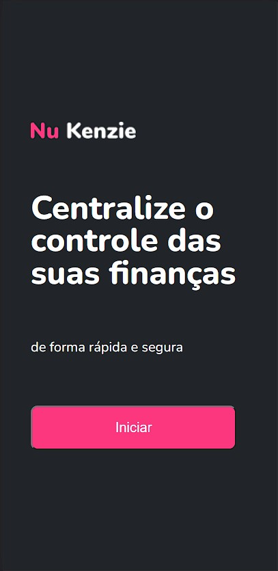
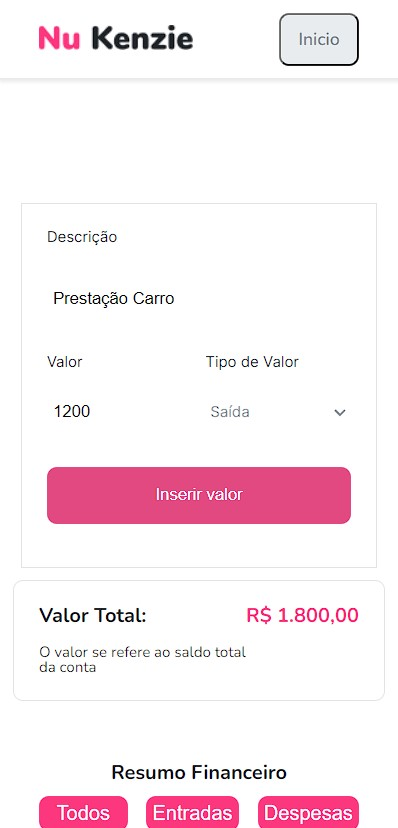
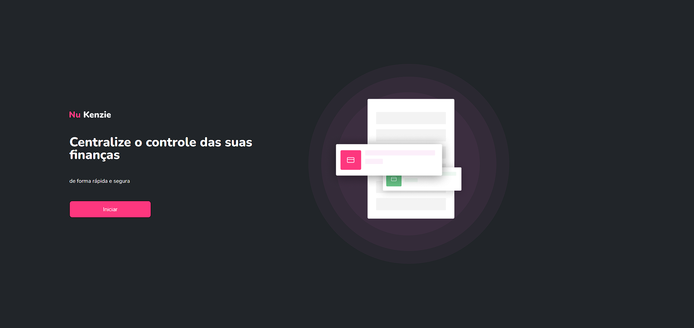
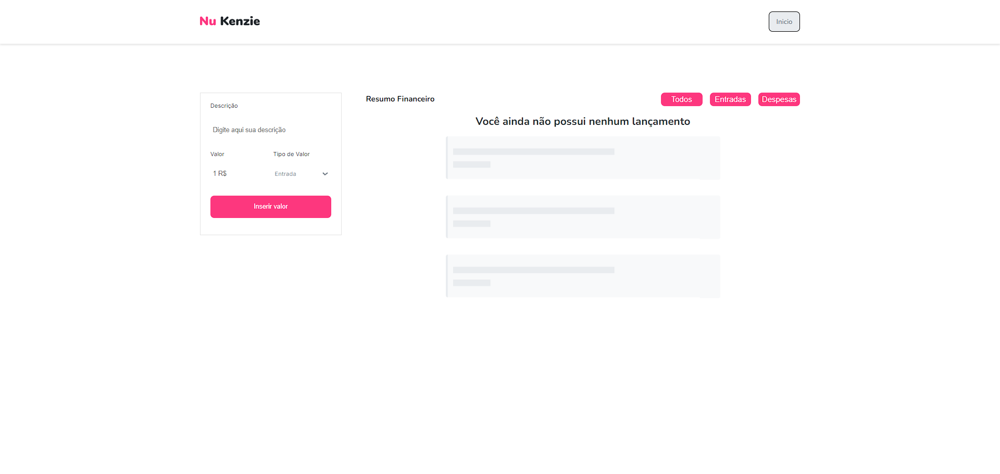
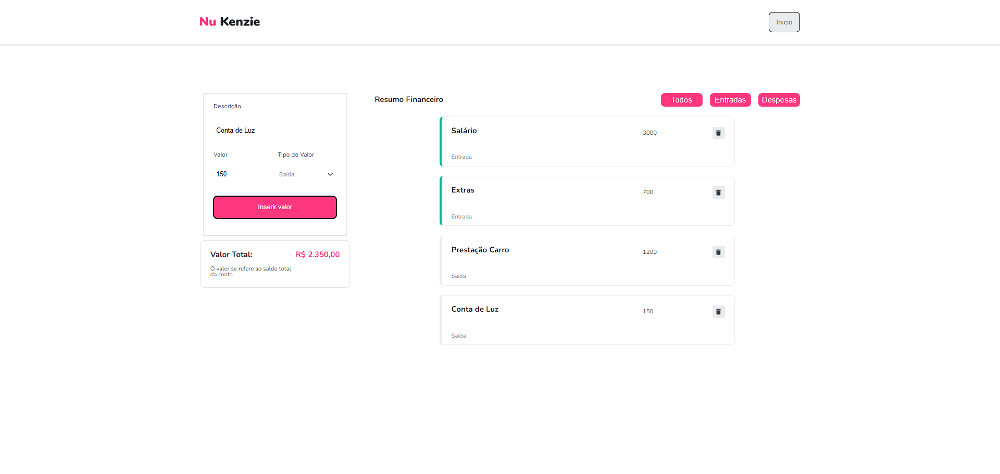

<h1 align="center">
    
</h1>

## 🔭 Acesse o Deploy do Projeto Aqui: [Nu Kenzie]()

## 💻 Sobre o projeto

💲 Nu Kenzie - é uma aplicação para gerenciamento de gastos, cadastrando entradas e saídas.

- Registro das suas transações financeiras - Receitas e Despesas
- Cálculo do saldo total da sua conta atualizado automaticamente a cada transação
- Filtros para análise mais detalhada dos registros, separados por todos, entradas e saídas


Projeto desenvolvido durante o curso de **Desenvolvimento FullStack** oferecido pela [Kenzie Academy Brasil](https://kenzie.com.br/). A Kenzie é uma escola de programação com um ensino de qualidade que capacita seus aluno para se tornarem desenvolvedores FullStack em 12 meses!


## 🎨 Layout

O layout da aplicação está disponível no Figma:

<a href="https://www.figma.com/file/h8s0VHmSEUucfc7B3igKbb/M3---Gerenciador-de-Finan%C3%A7as?node-id=0%3A1&t=CauOKfpRG9kzmggW-0">
  
</a>

### Mobile

<p align="center">
  

  
</p>

### Web

<p align="center" style="display: flex; align-items: flex-start; justify-content: center;">
  

  
  
  
</p>

## 🛠 Tecnologias

As seguintes ferramentas foram usadas na construção do projeto:

- [Figma]()
- [React]()
- [Javascript]()
- [Vercel]()
- [Git]()
- [Github]()

## 🚀 Como executar o projeto

### Pré-requisitos

Antes de começar, você vai precisar ter instalado o [Git](https://git-scm.com) em sua máquina. 
Além disto é bom ter um editor para trabalhar com o código como [VSCode][vscode]

### 🧭 Rodando a aplicação web localmente na sua máquina (Front End)

```bash
# Clone este repositório
$ git clone https://github.com/patrickcordeiroestudos/Nu-Kenzie.git

# Acesse a pasta do projeto no seu terminal/cmd
$ cd Nu-Kenzie

# Instale as dependências
$ yarn

# Execute a aplicação em modo de desenvolvimento
$ yarn start

# A aplicação será aberta na porta:3000 - acesse http://localhost:3000
```

## 😯 Como contribuir para o projeto

1. Faça um **fork** do projeto.
2. Crie uma nova branch com as suas alterações: `git checkout -b my-feature`
3. Salve as alterações e crie uma mensagem de commit contando o que você fez: `git commit -m "feature: My new feature"`
4. Envie as suas alterações: `git push origin my-feature`
> Caso tenha alguma dúvida confira este [guia de como contribuir no GitHub](https://github.com/firstcontributions/first-contributions)

## 📝 Licença

Este projeto esta sobe a licença MIT.

Feito com ❤️ por Patrick Cordeiro 👋🏽 [Entre em contato!](https://www.linkedin.com/in/patrickcordeiro/)
